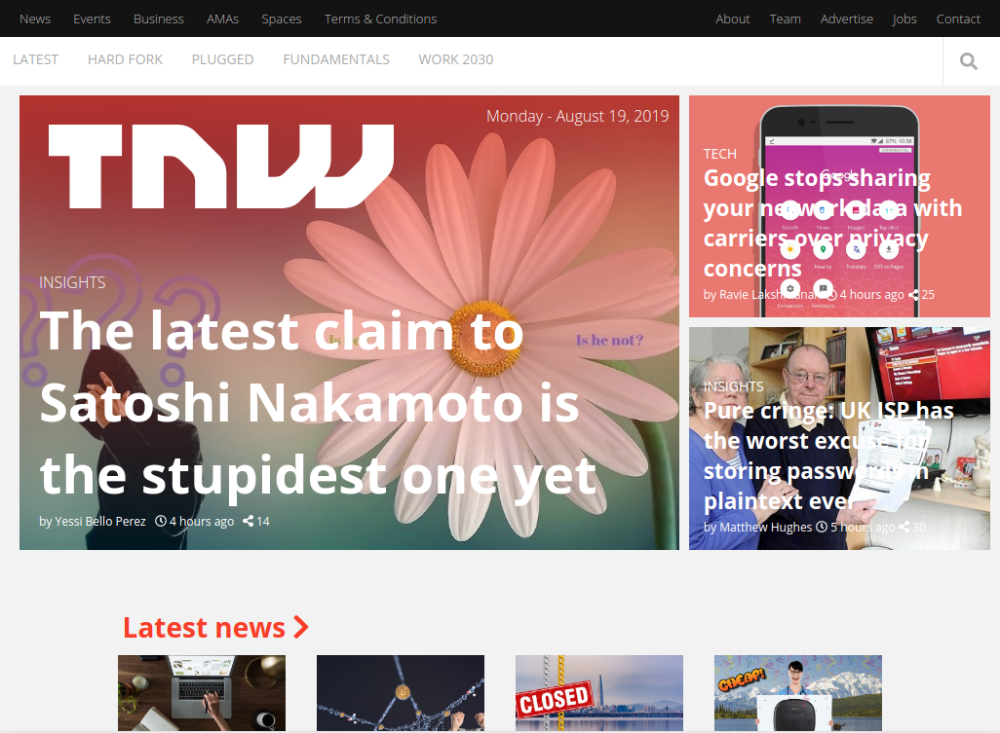

# Building with Responsive Design

> This project consists on a clone for the [TNW](https://thenextweb.com/) homepage, with the objective of building a responsive design.

You can find the original description in [The Odin Project](https://www.theodinproject.com/courses/html5-and-css3/lessons/building-with-responsive-design)

## Built With

- HTML, CSS3

## Live Demo

[Live Demo Link](https://rawcdn.githack.com/bruna-genz/next-web-page/cdcfb76b7b27b6372e1ebdf849f76abe1892d3dc/index.html)

## Getting Started

To get a local copy up and running follow these simple example steps.
- open a new terminal and run the following command:
- `git clone git@github.com:bruna-genz/next-web-page.git`

### Prerequisites
- web browser

## Authors

:man: **Oscar De La Lanza**

- Github: [@oscardelalanza](https://github.com/oscardelalanza)
- Twitter: [@oscardelalanza](https://twitter.com/oscardelalanza)
- Linkedin: [Oscar De La Lanza](https://linkedin.com/in/oscardelalanza)

:woman: **Bruna Genz**

- Github: [@bruna-genz](https://github.com/bruna-genz)
- Twitter: [@Bruna_GK](https://twitter.com/Bruna_GK)
- Linkedin: [Bruna Genz](https://www.linkedin.com/in/brunagenz/)

## 🤝 Contributing

Contributions, issues and feature requests are welcome!

## Show your support

Give a ⭐️ if you like this project!
